# MVP – Engenharia de Dados · Pipeline de Dados na Nuvem
## Logística, satisfação e vendas no e-commerce brasileiro (Olist)

**Pós-graduação em Ciência de Dados e Analytics – PUC-Rio · Sprint: Engenharia de Dados**
**Plataforma:** Databricks Free Edition (Lakehouse · Delta Lake · Unity Catalog) · **Linguagens:** PySpark e SQL

Este repositório contém um pipeline de dados completo, de ponta a ponta: da definição do problema à análise final.
Os dados passam pela **arquitetura medalhão** (Landing → Bronze → Silver → Gold), são modelados em um **esquema dimensional** (constelação),
documentados em um **catálogo de dados** no Unity Catalog e verificados quanto à **qualidade** antes de responderem às perguntas de negócio.

### Sumário
1. [Contexto de Negócio e Perguntas (Etapa 2 e 4.1)](#1-contexto-de-negócio-e-perguntas-etapa-2-e-41)
2. [Carga dos Dados (Etapa 4.2)](#2-carga-dos-dados-etapa-42)
3. [Modelagem e Catálogo de Dados (Etapa 4.3)](#3-modelagem-e-catálogo-de-dados-etapa-43)
4. [Pipeline de Dados (Etapa 4.4)](#4-pipeline-de-dados-etapa-44)
5. [Qualidade de Dados (Etapa 4.5)](#5-qualidade-de-dados-etapa-45)
6. [Análise de Dados (Etapa 4.5)](#6-análise-de-dados-etapa-45)
7. [Autoavaliação](#7-autoavaliação)

### Estrutura do repositório

```
├── README.md                          ← este documento (relatório do MVP)
├── notebooks/                         ← notebooks Databricks (formato source .py, importáveis no workspace)
│   ├── 00_setup_ambiente.py           ← catálogo, schemas e volume no Unity Catalog
│   ├── 01_bronze_ingestao.py          ← CSV (Volume) → tabelas Delta Bronze
│   ├── 02_silver_transformacao.py     ← limpeza, tipagem, deduplicação, padronização
│   ├── 03_gold_modelagem.py           ← modelo dimensional + catálogo (COMMENTs, PK/FK)
│   ├── 04_qualidade_dados.py          ← perfil e verificações de qualidade
│   └── 05_analise_negocio.py          ← consultas SQL e discussão das perguntas
└── images/                            ← screenshots de evidência da execução no Databricks
```

> Os dados **não** são versionados neste repositório (ver licença na seção 1.4). Para reproduzir o pipeline: baixar o dataset do Kaggle,
> enviá-lo ao Volume `mvp.landing.olist_raw` e executar os notebooks na ordem `00 → 05`.

---

# 1. Contexto de Negócio e Perguntas (Etapa 2 e 4.1)

## 1.1 Problema

A **Olist** é um marketplace que conecta pequenos e médios lojistas aos grandes canais de venda online do Brasil. Ela assume a vitrine, o pagamento
e a coordenação logística. Nesse modelo, a experiência do cliente depende de uma cadeia longa: o vendedor (majoritariamente em SP) posta o produto,
a transportadora percorre distâncias continentais e o cliente avalia a compra ao final.

> **Problema:** *entender o que impulsiona as vendas e a satisfação dos clientes do marketplace Olist, com foco no papel da logística
> (prazo e atraso de entrega) — e onde (regiões, períodos, categorias) estão as maiores oportunidades de melhoria.*

Na prática, o pedido chega ao time de dados como uma demanda vaga: *"estamos crescendo, mas as avaliações ruins preocupam"*. Cabe à Engenharia de Dados
traduzir isso em perguntas objetivas e montar a base que permite respondê-las. Esse objetivo guiou todas as decisões técnicas:
a escolha das tabelas, o grão de cada fato (item × pedido), a necessidade de uma dimensão de tempo diária (para a Black Friday) e a criação de
métricas logísticas já calculadas na Gold (`dias_entrega`, `dias_atraso`, `flag_atraso`).

## 1.2 Perguntas de negócio

| # | Pergunta | Por que importa |
|---|---|---|
| **P1** | Como evoluíram **pedidos e receita** mês a mês? Existe **sazonalidade** (ex.: Black Friday)? | Dimensiona o crescimento e os picos que pressionam a operação |
| **P2** | Quais **categorias** concentram a receita e qual o **preço médio** delas? | Direciona o foco comercial |
| **P3** | Como **pedidos, frete relativo, prazo e atraso** variam entre **regiões/UFs**? | Mede a desigualdade logística do país |
| **P4** | O **atraso na entrega impacta a nota** de avaliação do cliente? | Hipótese central do problema |
| **P5** | Quais **meios de pagamento** predominam e como o **parcelamento** se relaciona com o valor do pedido? | Entende o comportamento de compra |
| **P6** | Qual a **taxa de recompra**? Uma experiência ruim na 1ª compra reduz a chance de o cliente voltar? | Liga satisfação a retenção |

## 1.3 Fonte e contexto dos dados brutos

**Dataset:** [Brazilian E-Commerce Public Dataset by Olist](https://www.kaggle.com/datasets/olistbr/brazilian-ecommerce) (Kaggle).
São dados **reais e anonimizados** de cerca de 100 mil pedidos feitos entre **set/2016 e out/2018** em diversos marketplaces brasileiros.
Os nomes de lojas e parceiros foram substituídos por nomes de casas de *Game of Thrones* e os identificadores são hashes. Não há dados pessoais (nome, CPF, e-mail).

São **9 arquivos CSV** relacionados por chaves (modelo relacional normalizado de origem):

| Arquivo | Linhas | Colunas (dado bruto) | Conteúdo |
|---|---:|---|---|
| `olist_orders_dataset.csv` | 99.441 | order_id, customer_id, order_status, order_purchase_timestamp, order_approved_at, order_delivered_carrier_date, order_delivered_customer_date, order_estimated_delivery_date | Pedido e datas do ciclo de vida |
| `olist_order_items_dataset.csv` | 112.650 | order_id, order_item_id, product_id, seller_id, shipping_limit_date, price, freight_value | Itens de cada pedido |
| `olist_order_payments_dataset.csv` | 103.886 | order_id, payment_sequential, payment_type, payment_installments, payment_value | Pagamentos |
| `olist_order_reviews_dataset.csv` | 99.224 | review_id, order_id, review_score, review_comment_title, review_comment_message, review_creation_date, review_answer_timestamp | Avaliações (nota 1–5) |
| `olist_customers_dataset.csv` | 99.441 | customer_id, customer_unique_id, customer_zip_code_prefix, customer_city, customer_state | Clientes |
| `olist_products_dataset.csv` | 32.951 | product_id, product_category_name, product_name_lenght, product_description_lenght, product_photos_qty, product_weight_g, product_length_cm, product_height_cm, product_width_cm | Produtos |
| `olist_sellers_dataset.csv` | 3.095 | seller_id, seller_zip_code_prefix, seller_city, seller_state | Vendedores |
| `product_category_name_translation.csv` | 71 | product_category_name, product_category_name_english | Tradução das categorias |
| `olist_geolocation_dataset.csv` | 1.000.163 | geolocation_zip_code_prefix, geolocation_lat, geolocation_lng, geolocation_city, geolocation_state | Coordenadas por CEP *(carregada na Bronze, não usada adiante)* |

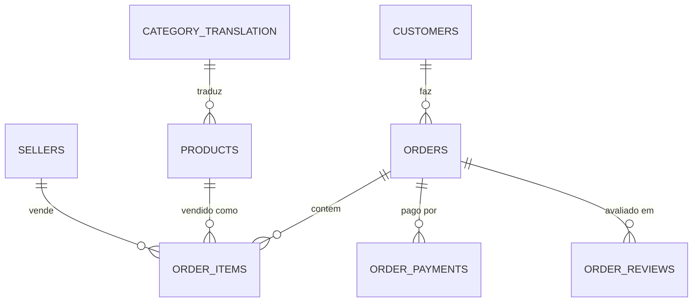
```mermaid
erDiagram
    ORDERS ||--o{ ORDER_ITEMS : contem
    ORDERS ||--o{ ORDER_PAYMENTS : "pago por"
    ORDERS ||--o{ ORDER_REVIEWS : "avaliado em"
    CUSTOMERS ||--o{ ORDERS : faz
    PRODUCTS ||--o{ ORDER_ITEMS : "vendido como"
    SELLERS ||--o{ ORDER_ITEMS : vende
    CATEGORY_TRANSLATION ||--o{ PRODUCTS : traduz
```

## 1.4 Licença de uso

O dataset é publicado pela Olist no Kaggle sob a licença **[CC BY-NC-SA 4.0](https://creativecommons.org/licenses/by-nc-sa/4.0/)**
(Creative Commons Atribuição–NãoComercial–CompartilhaIgual):

- **BY (Atribuição):** é obrigatório citar a fonte, o que é feito nesta seção.
- **NC (Não Comercial):** o uso deste MVP é **acadêmico**, sem fins comerciais. ✔
- **SA (Compartilha Igual):** trabalhos derivados que redistribuam os dados devem usar a mesma licença.

Por prudência e por não ser exigido no MVP, **os arquivos de dados não são redistribuídos** neste repositório (pasta `data/` no `.gitignore`).
Apenas o código e os resultados agregados são publicados.

---

# 2. Carga dos Dados (Etapa 4.2)

A coleta foi feita em duas etapas:

1. **Download:** o zip do dataset (~45 MB, 9 CSVs) foi baixado manualmente do Kaggle, que exige login.
2. **Upload para a nuvem:** os 9 CSVs foram enviados pela interface do Databricks para um **Volume do Unity Catalog**,
   `mvp.landing.olist_raw`, que funciona como a área de pouso (*landing zone*) do Lakehouse. Catálogo, schemas e volume são criados via código no
   notebook [`00_setup_ambiente.py`](notebooks/00_setup_ambiente.py), que também confere se os 9 arquivos esperados chegaram.

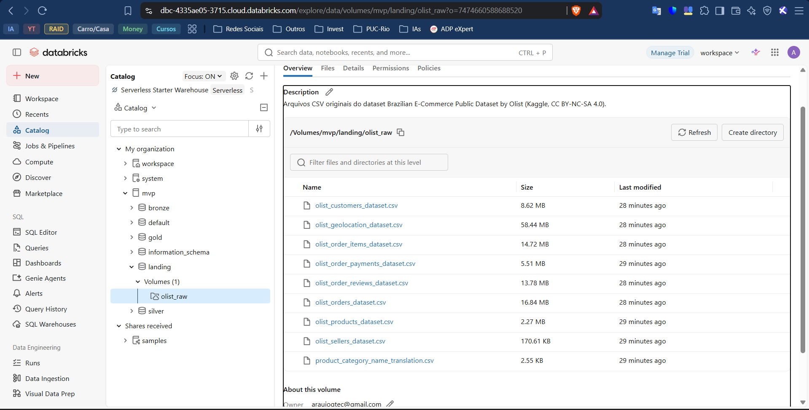

3. **Ingestão na Bronze:** o notebook [`01_bronze_ingestao.py`](notebooks/01_bronze_ingestao.py) lê cada CSV do Volume com PySpark e grava uma
   **tabela Delta** no schema `mvp.bronze`. Decisões:
   - leitura com `inferSchema = false`: **todas as colunas como STRING**, para preservar o dado exatamente como veio;
   - `multiLine = true` e `escape = '"'`, porque os comentários das avaliações têm quebras de linha e aspas;
   - inclusão das colunas de controle **`_arquivo_origem`** (linhagem) e **`_data_ingestao`** (quando a linha foi carregada);
   - carga completa (`overwrite`), idempotente: reexecutar o notebook produz o mesmo resultado.

**Automação possível (trabalho futuro):** a Olist não publica atualizações do dataset, então a carga é única. Em um cenário real, o passo 1
poderia ser automatizado pela API do Kaggle (`kaggle datasets download`) e os notebooks orquestrados em um **Databricks Job** agendado.

---

# 3. Modelagem e Catálogo de Dados (Etapa 4.3)

## 3.1 Organização no Lakehouse

| Camada | Objeto no Unity Catalog | Tabelas |
|---|---|---|
| Landing | Volume `mvp.landing.olist_raw` | 9 arquivos CSV originais |
| Bronze | Schema `mvp.bronze` | `clientes`, `pedidos`, `itens_pedido`, `pagamentos`, `avaliacoes`, `produtos`, `vendedores`, `traducao_categorias`, `geolocalizacao` |
| Silver | Schema `mvp.silver` | `clientes`, `pedidos`, `itens_pedido`, `pagamentos`, `avaliacoes`, `produtos`, `vendedores` + tabelas de controle (`controle_carga`, `qualidade_perfil_bronze`, `qualidade_verificacoes`) |
| Gold | Schema `mvp.gold` | `fato_pedidos`, `fato_itens_pedido`, `dim_tempo`, `dim_cliente`, `dim_produto`, `dim_vendedor` |

## 3.2 Modelo dimensional (Gold): esquema constelação

Foi adotado um **esquema constelação** (*galaxy schema*): **duas tabelas fato** que compartilham **dimensões conformadas**.

**Por que duas fatos?** As métricas de interesse vivem em **grãos diferentes**. Preço e frete pertencem ao **item**; prazo, atraso, nota e pagamento
pertencem ao **pedido**. Colocar tudo em uma única tabela no grão do item repetiria a nota e o valor pago de um pedido em cada um dos seus itens,
inflando somas e distorcendo médias (*fan-out*). Com duas fatos, cada pergunta usa a tabela no grão correto: P2 usa `fato_itens_pedido`
e P1, P3, P4, P5 e P6 usam `fato_pedidos`.

**Por que não snowflake?** As dimensões são pequenas (a maior tem 99 mil linhas) e o ganho de normalizar, por exemplo, `categoria` em uma tabela
própria não compensa o custo de joins extras nas consultas analíticas. A tradução das categorias foi **desnormalizada** para dentro de `dim_produto`.

**Chaves:** os IDs da Olist já são hashes únicos e estáveis e foram usados como chaves das dimensões. `dim_tempo` usa uma **chave substituta**
inteira `sk_data` no formato `AAAAMMDD`. As restrições **PRIMARY KEY / FOREIGN KEY** foram declaradas no Unity Catalog (informativas).

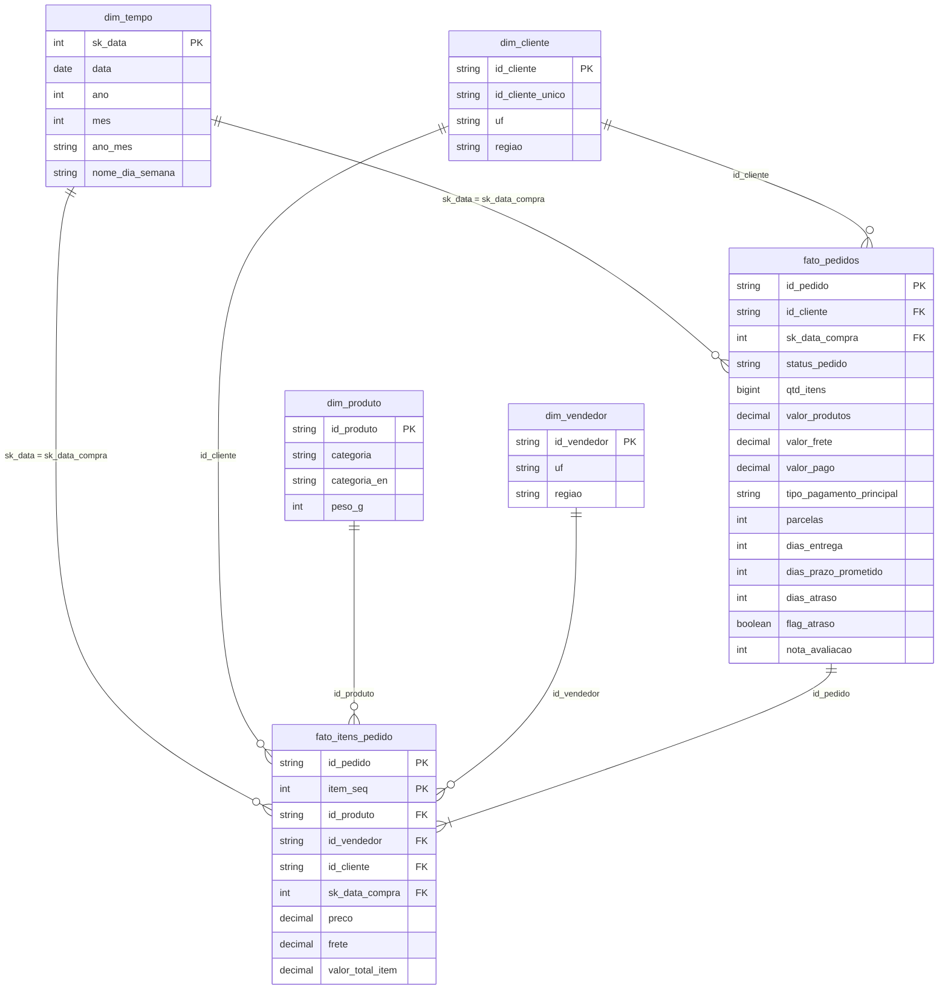
```mermaid
erDiagram
    dim_tempo    ||--o{ fato_pedidos      : "sk_data = sk_data_compra"
    dim_cliente  ||--o{ fato_pedidos      : id_cliente
    dim_tempo    ||--o{ fato_itens_pedido : "sk_data = sk_data_compra"
    dim_cliente  ||--o{ fato_itens_pedido : id_cliente
    dim_produto  ||--o{ fato_itens_pedido : id_produto
    dim_vendedor ||--o{ fato_itens_pedido : id_vendedor
    fato_pedidos ||--|{ fato_itens_pedido : id_pedido

    fato_pedidos {
        string  id_pedido PK
        string  id_cliente FK
        int     sk_data_compra FK
        string  status_pedido
        bigint  qtd_itens
        decimal valor_produtos
        decimal valor_frete
        decimal valor_pago
        string  tipo_pagamento_principal
        int     parcelas
        int     dias_entrega
        int     dias_prazo_prometido
        int     dias_atraso
        boolean flag_atraso
        int     nota_avaliacao
    }
    fato_itens_pedido {
        string  id_pedido PK
        int     item_seq PK
        string  id_produto FK
        string  id_vendedor FK
        string  id_cliente FK
        int     sk_data_compra FK
        decimal preco
        decimal frete
        decimal valor_total_item
    }
    dim_tempo {
        int     sk_data PK
        date    data
        int     ano
        int     mes
        string  ano_mes
        string  nome_dia_semana
    }
    dim_cliente {
        string id_cliente PK
        string id_cliente_unico
        string uf
        string regiao
    }
    dim_produto {
        string id_produto PK
        string categoria
        string categoria_en
        int    peso_g
    }
    dim_vendedor {
        string id_vendedor PK
        string uf
        string regiao
    }
```

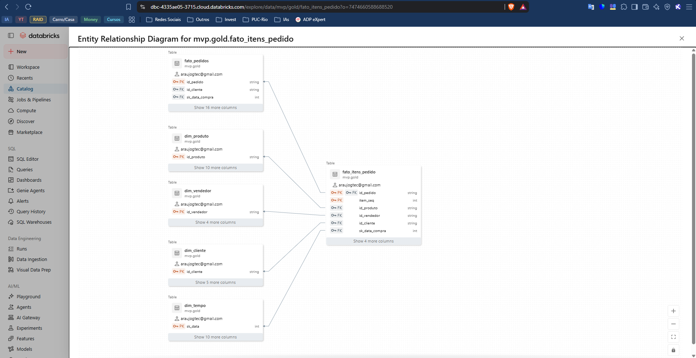

## 3.3 Catálogo de Dados

O catálogo foi implementado **no próprio Unity Catalog**: toda tabela e toda coluna das camadas Bronze, Silver e Gold recebeu um `COMMENT`
com descrição, domínio e linhagem, aplicado por código nos notebooks. Assim, a documentação fica versionada junto ao pipeline e visível no Catalog Explorer.
O notebook `03` gera o catálogo consultando o `information_schema`. A transcrição abaixo cobre a **camada Gold** (camada de consumo).
A linhagem completa até a Bronze está no campo **Origem**, e as tabelas Silver têm estrutura equivalente, com nomes de coluna já em português.

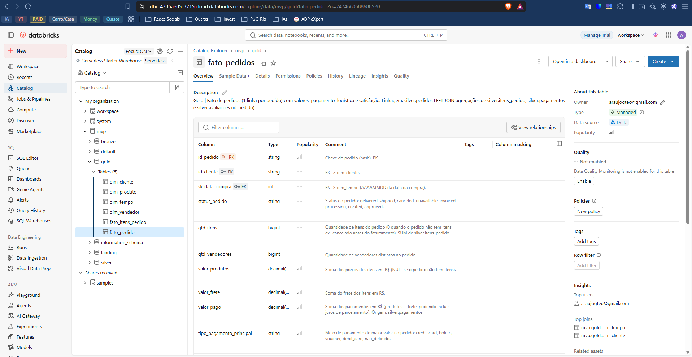
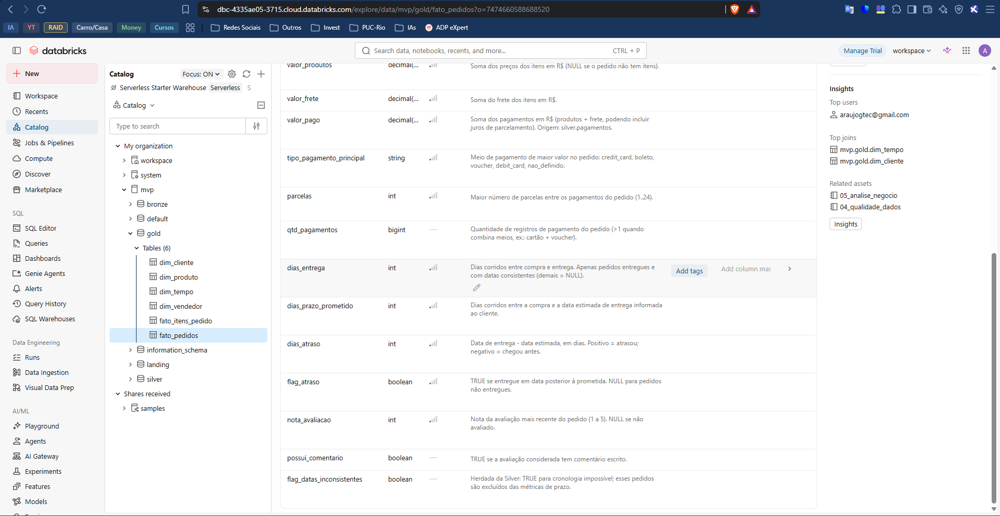

### `mvp.gold.fato_pedidos`
Fato no grão de **pedido** (99.441 linhas). Consolida valores, pagamento, métricas logísticas e satisfação.
**Linhagem:** `silver.pedidos` LEFT JOIN agregações de `silver.itens_pedido`, `silver.pagamentos` e `silver.avaliacoes` por `id_pedido`.

| Coluna | Tipo | Descrição | Domínio | Origem / transformação |
|---|---|---|---|---|
| id_pedido | STRING | Chave do pedido (PK) | hash 32 caracteres, único | orders.order_id |
| id_cliente | STRING | FK → dim_cliente | hash 32 caracteres | orders.customer_id |
| sk_data_compra | INT | FK → dim_tempo | 20160904 a 20181017 | orders.order_purchase_timestamp → AAAAMMDD |
| status_pedido | STRING | Status do pedido | delivered, shipped, canceled, unavailable, invoiced, processing, created, approved | orders.order_status (minúsculas) |
| qtd_itens | BIGINT | Nº de itens do pedido | 0 a 21 (0 = pedido sem itens) | COUNT(itens) |
| qtd_vendedores | BIGINT | Nº de vendedores distintos | 0 a 5 | COUNT DISTINCT(itens.seller_id) |
| valor_produtos | DECIMAL(12,2) | Soma dos preços dos itens (R$) | 0,85 a 13.440,00; NULL sem itens | SUM(items.price) |
| valor_frete | DECIMAL(12,2) | Soma do frete (R$) | 0 a 1.794,96 | SUM(items.freight_value) |
| valor_pago | DECIMAL(12,2) | Soma dos pagamentos (R$) | 0 a 13.664,08 | SUM(payments.payment_value) |
| tipo_pagamento_principal | STRING | Meio de pagamento de maior valor | credit_card, boleto, voucher, debit_card, nao_definido | payments.payment_type, `row_number` por valor |
| parcelas | INT | Maior nº de parcelas do pedido | 1 a 24 | MAX(payments.payment_installments), 0 → 1 |
| qtd_pagamentos | BIGINT | Nº de registros de pagamento | 1 a 29 | COUNT(payments) |
| dias_entrega | INT | Dias entre compra e entrega | 0 a 210; NULL se não entregue | datediff(delivered_customer, purchase) |
| dias_prazo_prometido | INT | Dias entre compra e data estimada | 2 a 156 | datediff(estimated, purchase) |
| dias_atraso | INT | Entrega − data estimada (dias) | −147 a 188 (positivo = atraso) | datediff(delivered_customer, estimated) |
| flag_atraso | BOOLEAN | Entregue após a data prometida | TRUE / FALSE / NULL | dias_atraso > 0 |
| nota_avaliacao | INT | Nota da avaliação mais recente | 1 a 5; NULL sem avaliação | reviews.review_score, `row_number` por data |
| possui_comentario | BOOLEAN | Avaliação tem comentário escrito | TRUE / FALSE / NULL | reviews.review_comment_message IS NOT NULL |
| flag_datas_inconsistentes | BOOLEAN | Cronologia impossível | TRUE (8 pedidos) / FALSE | regra da Silver |

### `mvp.gold.fato_itens_pedido`
Fato no grão de **item vendido** (112.650 linhas). **Linhagem:** `silver.itens_pedido` INNER JOIN `silver.pedidos` por `id_pedido`.

| Coluna | Tipo | Descrição | Domínio | Origem |
|---|---|---|---|---|
| id_pedido | STRING | Pedido do item (PK composta; FK → fato_pedidos) | hash | items.order_id |
| item_seq | INT | Sequência do item no pedido (PK composta) | 1 a 21 | items.order_item_id |
| id_produto | STRING | FK → dim_produto | hash | items.product_id |
| id_vendedor | STRING | FK → dim_vendedor | hash | items.seller_id |
| id_cliente | STRING | FK → dim_cliente | hash | orders.customer_id (via join) |
| sk_data_compra | INT | FK → dim_tempo | 20160904 a 20181017 | orders.order_purchase_timestamp |
| status_pedido | STRING | Status do pedido (dimensão degenerada) | igual a fato_pedidos | orders.order_status |
| preco | DECIMAL(12,2) | Preço do item (R$) | 0,85 a 6.735,00 | items.price |
| frete | DECIMAL(12,2) | Frete rateado ao item (R$) | 0 a 409,68 | items.freight_value |
| valor_total_item | DECIMAL(12,2) | preco + frete | 0,85 a 6.929,31 | derivada |

### `mvp.gold.dim_tempo`
Calendário diário **sem lacunas** de 04/09/2016 a 17/10/2018 (774 dias), gerado a partir do intervalo de `silver.pedidos.data_compra`.

| Coluna | Tipo | Descrição | Domínio |
|---|---|---|---|
| sk_data | INT | Chave substituta AAAAMMDD (PK) | 20160904 a 20181017 |
| data | DATE | Data | 2016-09-04 a 2018-10-17 |
| ano | INT | Ano | 2016, 2017, 2018 |
| trimestre | INT | Trimestre | 1 a 4 |
| mes | INT | Mês | 1 a 12 |
| nome_mes | STRING | Nome do mês | janeiro … dezembro |
| ano_mes | STRING | Ano-mês para séries | AAAA-MM |
| dia | INT | Dia do mês | 1 a 31 |
| dia_semana | INT | Dia da semana | 1 (domingo) a 7 (sábado) |
| nome_dia_semana | STRING | Nome do dia | domingo … sábado |
| flag_fim_de_semana | BOOLEAN | Sábado ou domingo | TRUE / FALSE |

### `mvp.gold.dim_cliente`
Uma linha por `id_cliente` (99.441). **Linhagem:** `silver.clientes` + região derivada.

| Coluna | Tipo | Descrição | Domínio | Origem |
|---|---|---|---|---|
| id_cliente | STRING | Chave do cliente no pedido (PK) | hash | customers.customer_id |
| id_cliente_unico | STRING | Identificador da pessoa (recompra) | hash; 96.096 distintos | customers.customer_unique_id |
| cep_prefixo | STRING | 5 primeiros dígitos do CEP | 00000–99999 | customers.customer_zip_code_prefix (lpad 5) |
| cidade | STRING | Cidade (minúsculas, sem acento) | 4.119 cidades | customers.customer_city |
| uf | STRING | Unidade federativa | 27 siglas | customers.customer_state (maiúsculas, validada) |
| regiao | STRING | Região do IBGE | Norte, Nordeste, Centro-Oeste, Sudeste, Sul | derivada da UF |

### `mvp.gold.dim_produto`
Uma linha por produto (32.951). **Linhagem:** `silver.produtos` (= products LEFT JOIN category_translation) + volume derivado.

| Coluna | Tipo | Descrição | Domínio | Origem |
|---|---|---|---|---|
| id_produto | STRING | Chave do produto (PK) | hash | products.product_id |
| categoria | STRING | Categoria em português | 73 categorias + `sem_categoria` | products.product_category_name (nulo → sem_categoria) |
| categoria_en | STRING | Categoria em inglês | 71 traduções + fallback em português | translation.product_category_name_english |
| qtd_caracteres_nome | INT | Tamanho do nome do anúncio | 5 a 76 | products.product_name_lenght |
| qtd_caracteres_descricao | INT | Tamanho da descrição | 4 a 3.992 | products.product_description_lenght |
| qtd_fotos | INT | Nº de fotos | 1 a 20 | products.product_photos_qty |
| peso_g | INT | Peso (g) | 0 a 40.425 | products.product_weight_g |
| comprimento_cm | INT | Comprimento (cm) | 7 a 105 | products.product_length_cm |
| altura_cm | INT | Altura (cm) | 2 a 105 | products.product_height_cm |
| largura_cm | INT | Largura (cm) | 6 a 118 | products.product_width_cm |
| volume_cm3 | INT | comprimento × altura × largura | 168 a 296.208 | derivada |

### `mvp.gold.dim_vendedor`
Uma linha por vendedor (3.095). **Linhagem:** `silver.vendedores` + região derivada.

| Coluna | Tipo | Descrição | Domínio | Origem |
|---|---|---|---|---|
| id_vendedor | STRING | Chave do vendedor (PK) | hash | sellers.seller_id |
| cep_prefixo | STRING | 5 primeiros dígitos do CEP | 00000–99999 | sellers.seller_zip_code_prefix |
| cidade | STRING | Cidade (com ruído de digitação na fonte) | 611 valores | sellers.seller_city |
| uf | STRING | Unidade federativa | 23 UFs com vendedores | sellers.seller_state |
| regiao | STRING | Região do IBGE | 5 regiões | derivada da UF |

---

# 4. Pipeline de Dados (Etapa 4.4)

## 4.1 Organização

O pipeline foi **ramificado em 6 notebooks**, um por responsabilidade, executados em sequência. Cada notebook lê de uma camada e grava na seguinte:

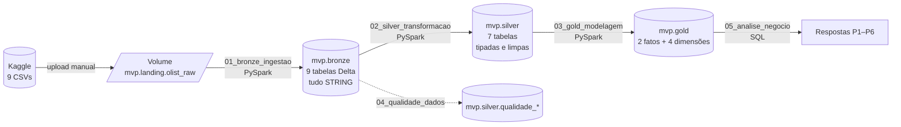
```mermaid
flowchart LR
    K[(Kaggle<br/>9 CSVs)] -->|upload manual| V[/Volume<br/>mvp.landing.olist_raw/]
    V -->|01_bronze_ingestao<br/>PySpark| B[(mvp.bronze<br/>9 tabelas Delta<br/>tudo STRING)]
    B -->|02_silver_transformacao<br/>PySpark| S[(mvp.silver<br/>7 tabelas<br/>tipadas e limpas)]
    S -->|03_gold_modelagem<br/>PySpark| G[(mvp.gold<br/>2 fatos + 4 dimensões)]
    B -.->|04_qualidade_dados| Q[(mvp.silver.qualidade_*)]
    G -->|05_analise_negocio<br/>SQL| R[Respostas P1–P6]
```

| Notebook | Entrada → Saída | O que faz |
|---|---|---|
| [`00_setup_ambiente`](notebooks/00_setup_ambiente.py) | — → catálogo `mvp`, schemas, volume | Cria a estrutura do Lakehouse e valida o upload |
| [`01_bronze_ingestao`](notebooks/01_bronze_ingestao.py) | Volume → `mvp.bronze.*` | Leitura dos CSVs como STRING + metadados de linhagem |
| [`02_silver_transformacao`](notebooks/02_silver_transformacao.py) | Bronze → `mvp.silver.*` | Renomeação, tipagem, padronização, deduplicação, tratamento de nulos/inválidos, join de tradução |
| [`03_gold_modelagem`](notebooks/03_gold_modelagem.py) | Silver → `mvp.gold.*` | Dimensões, fatos, agregações, métricas logísticas, COMMENTs e PK/FK |
| [`04_qualidade_dados`](notebooks/04_qualidade_dados.py) | Bronze/Silver/Gold → `mvp.silver.qualidade_*` | Perfil de completude de todos os atributos e verificações de qualidade |
| [`05_analise_negocio`](notebooks/05_analise_negocio.py) | Gold → resultados | Consultas SQL e discussão das perguntas |

## 4.2 Transformações documentadas

**Bronze → Silver** (detalhe e impacto registrados em `mvp.silver.controle_carga`):

| Tabela | Transformação | Por quê | Impacto |
|---|---|---|---|
| todas | Renomeação para português `snake_case` (e correção de `lenght` → comprimento) | Padronização semântica | nomes consistentes |
| todas | `trim` + deduplicação pela chave natural | Unicidade | 0 duplicatas exatas na fonte |
| pedidos | 5 datas de texto → `TIMESTAMP` (`try_to_timestamp`) | Tipagem para cálculos de prazo | 0 falhas de conversão |
| pedidos | `flag_datas_inconsistentes` | Isolar cronologia impossível sem perder o registro | 8 pedidos marcados |
| itens / pagamentos | preço, frete e valor → `DECIMAL(12,2)` | Precisão monetária | — |
| itens | remoção de preço nulo ou ≤ 0 | Acurácia | 0 linhas removidas |
| pagamentos | `not_defined` → `nao_definido`; parcelas 0 → 1 | Consistência / acurácia | 3 e 2 registros |
| avaliações | remoção de nota fora de 1–5; chave (`id_avaliacao`, `id_pedido`); `possui_comentario` | Acurácia / unicidade | 0 removidas |
| produtos | **LEFT JOIN** com a tradução pelo nome da categoria; nula → `sem_categoria`; sem tradução → nome em PT | Enriquecimento e completude | 610 produtos sem categoria; 2 categorias sem tradução |
| clientes / vendedores | UF maiúscula e validada; cidade minúscula sem acento; CEP com 5 dígitos | Consistência | — |

**Silver → Gold:**
- **JOIN** de `itens_pedido` com `pedidos` por `id_pedido` para trazer cliente, data e status para cada item (`fato_itens_pedido`).
- **Agregações** `GROUP BY id_pedido` de itens (qtd, soma de preço e frete) e pagamentos (soma, máx. parcelas); **`row_number`** para o meio de pagamento principal e para a avaliação mais recente.
- **Métricas logísticas** (`dias_entrega`, `dias_prazo_prometido`, `dias_atraso`, `flag_atraso`), calculadas só para pedidos entregues com datas consistentes. O atraso compara **datas** (sem hora), porque a data estimada da fonte vem sem horário.
- **Enriquecimento:** região IBGE a partir da UF e volume do produto.
- **`dim_tempo`** gerada com `sequence()` entre a menor e a maior data de compra.

## 4.3 Evidências de persistência na plataforma

| Evidência | Screenshot |
|---|---|
| Tabelas Bronze persistidas | 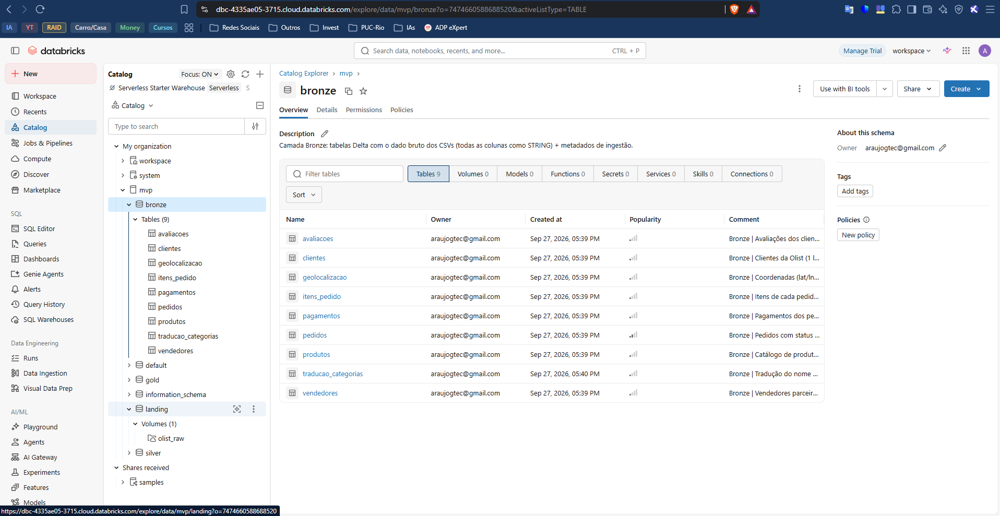 |
| Tabelas Silver persistidas + controle de carga | 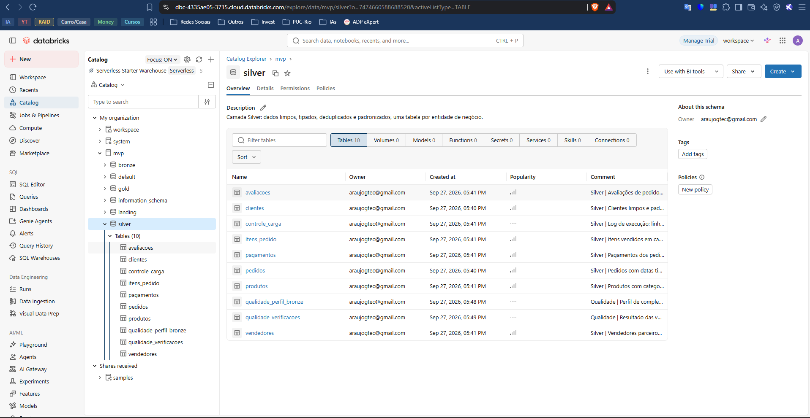 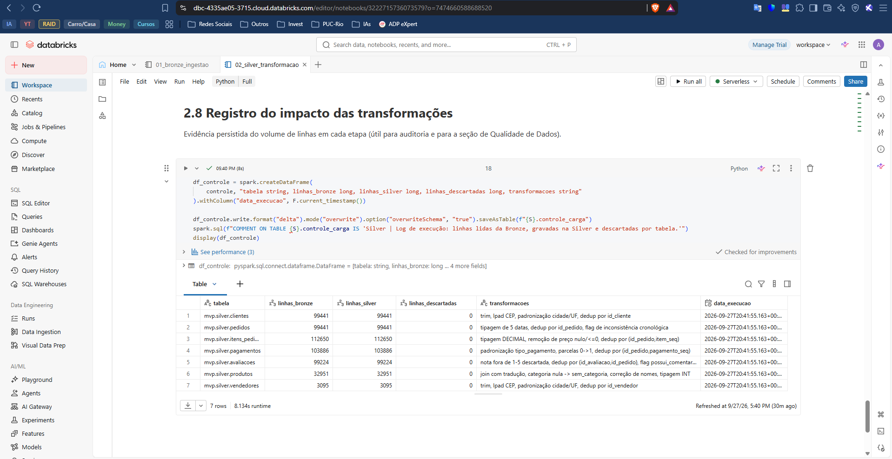 |
| Tabelas Gold persistidas | 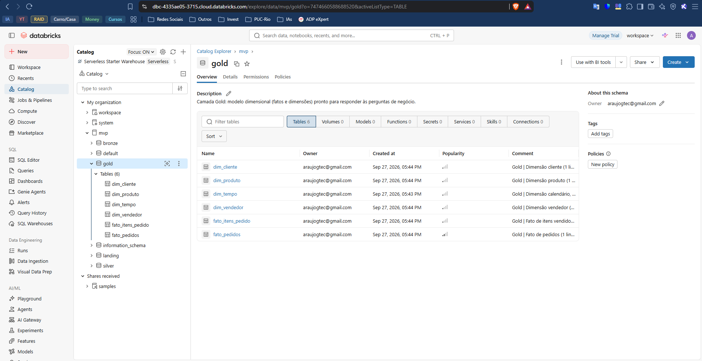 |

---

# 5. Qualidade de Dados (Etapa 4.5)

A qualidade foi verificada **sobre o dado bruto (Bronze)** no notebook [`04_qualidade_dados.py`](notebooks/04_qualidade_dados.py), em cinco dimensões.
Os resultados ficam persistidos em `mvp.silver.qualidade_perfil_bronze` (perfil de **cada atributo**) e `mvp.silver.qualidade_verificacoes` (regras).

## 5.1 Completude (perfil de todos os atributos)

Foram perfiladas **todas as 52 colunas** das 9 tabelas. Somente 13 colunas têm valores faltantes:

| Tabela.coluna | Nulos | Completude | Interpretação e tratamento |
|---|---:|---:|---|
| avaliacoes.review_comment_title | 87.658 | 11,66% | Campo opcional; mantido. Não é usado nas perguntas |
| avaliacoes.review_comment_message | 58.256 | 41,29% | Opcional; mantido e transformado em `possui_comentario` |
| pedidos.order_approved_at | 160 | 99,8% | Pedidos cancelados antes da aprovação; nulo **com significado**, mantido |
| pedidos.order_delivered_carrier_date | 1.783 | 98,2% | Pedidos não despachados; mantido |
| pedidos.order_delivered_customer_date | 2.965 | 97,0% | Pedidos não entregues; excluídos só das métricas de prazo |
| produtos.product_category_name (+ 3 colunas de texto/fotos) | 610 | 98,1% | Produtos sem cadastro de categoria: `sem_categoria` |
| produtos.peso/dimensões (4 colunas) | 2 | 99,99% | Mantidos (não usados nas perguntas) |

Todas as demais colunas, incluindo todas as chaves, têm **100% de completude**.

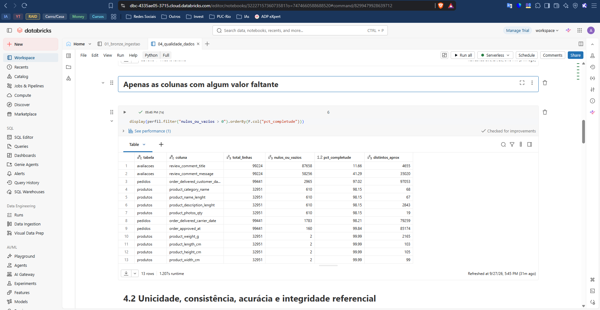

## 5.2 Unicidade, consistência, acurácia e integridade

| Dimensão | Verificação | Ocorrências | Tratamento no pipeline |
|---|---|---:|---|
| Unicidade | order_id / customer_id / product_id / (order_id, item) duplicados | **0** | dedup preventivo na Silver |
| Unicidade | review_id repetido em mais de um pedido | **814** | chave passa a ser (id_avaliacao, id_pedido) |
| Unicidade | pedidos com mais de uma avaliação | **547** | Gold usa a avaliação **mais recente** |
| Unicidade | pessoas (`customer_unique_id`) com mais de um `customer_id` | 2.997 | **esperado**: base da análise de recompra (P6) |
| Consistência | CEP com menos de 5 dígitos | 0 | `lpad` preventivo (leitura como texto preserva o zero) |
| Consistência | UF fora das 27 siglas | 0 | validação mantida |
| Consistência | cidade do vendedor com ruído (`/`, `\`, dígitos, `@`, ex.: "sao paulo / sp") | 23 | documentado; análises regionais usam a UF |
| Consistência | `payment_type = not_defined` | 3 | padronizado para `nao_definido` |
| Consistência | categorias sem tradução (`pc_gamer`, `portateis_cozinha_e_preparadores_de_alimentos`) | 2 | fallback para o nome em português |
| Acurácia | preço ≤ 0 / nota fora de 1–5 | 0 / 0 | regras mantidas como proteção |
| Acurácia | parcelas = 0 | 2 | corrigido para 1 |
| Acurácia | pagamento com valor 0 | 9 | mantido (vouchers) |
| Acurácia | entrega à transportadora **antes** da compra | 166 | documentado (não entra nas métricas) |
| Acurácia | status `delivered` sem data de entrega | 8 | `flag_datas_inconsistentes`; fora das métricas de prazo |
| Acurácia | status ≠ delivered porém com data de entrega | 6 | métricas consideram só `delivered` |
| Acurácia | produto com peso 0 g | 4 | mantido e documentado |
| Integridade | itens sem pedido / sem produto; pedidos sem cliente | 0 / 0 / 0 | — |
| Integridade | pedidos sem nenhum item | 775 | mantidos com `qtd_itens = 0` (maioria cancelados/indisponíveis) |
| Integridade | pedidos sem pagamento / sem avaliação | 1 / 768 | `valor_pago` / `nota_avaliacao` = NULL |

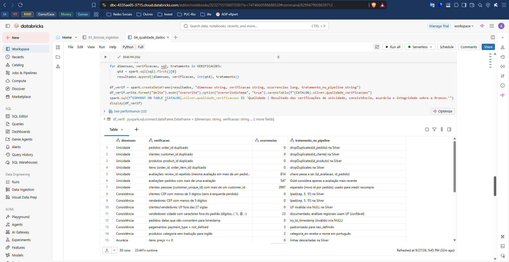
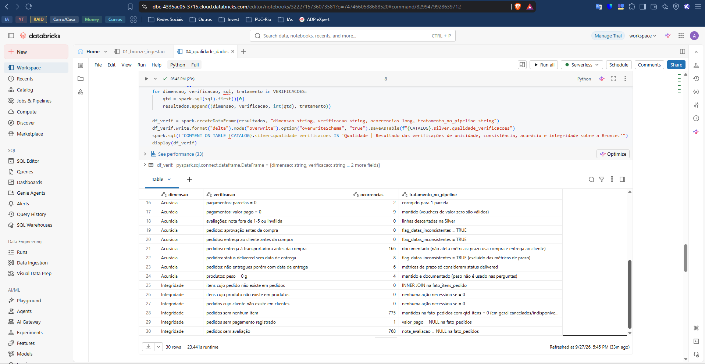

## 5.3 Outliers (regra IQR: > Q3 + 1,5 × IQR)

| Medida | Mediana | Q3 | P99 | Máximo | Limite IQR | % outliers |
|---|---:|---:|---:|---:|---:|---:|
| Preço do item (R$) | 74,99 | 134,90 | 890,00 | 6.735,00 | 277,40 | 7,5% |
| Frete do item (R$) | 16,26 | 21,15 | 84,52 | 409,68 | 33,25 | 10,3% |
| Valor pago no pedido (R$) | 105,29 | 176,97 | 1.075,79 | 13.664,08 | 349,41 | 7,9% |
| Dias de entrega | 10 | 16 | 46 | 210 | 29,5 | 4,9% |
| Peso do produto (g) | 700 | 1.900 | 22.538 | 40.425 | 4.300 | 13,8% |

**Decisão:** os extremos são **legítimos**: relógios e informática caros, frete para regiões remotas e atrasos reais. Removê-los esconderia exatamente
o fenômeno que o MVP investiga (atraso). Por isso **não foram removidos**, e as análises usam a **mediana** junto com a média quando a assimetria é relevante.

## 5.4 Conclusão

A base é bem curada. Não há duplicatas exatas nem quebras de integridade referencial, e as chaves são 100% completas. Os problemas encontrados são **pontuais e de semântica**:
avaliações duplicadas por pedido, datas incoerentes, categorias sem nome ou tradução, parcelas 0 e ruído nas cidades. Todos foram **tratados ou isolados por flag**
na Silver/Gold, e a seção 4.4 do notebook confirma que nenhum deles chega à camada de consumo.

---

# 6. Análise de Dados (Etapa 4.5)

Todas as consultas estão em [`05_analise_negocio.py`](notebooks/05_analise_negocio.py) e usam apenas a camada Gold.
**Convenções:** receita = soma do preço dos itens (sem frete) de pedidos não cancelados/indisponíveis; séries mensais de jan/2017 a ago/2018
(meses completos); métricas de prazo só para pedidos entregues com datas consistentes (96.470).

## P1 · Evolução de pedidos e receita e sazonalidade

| Mês | Pedidos | Receita (R$) | Ticket médio (R$) |
|---|---:|---:|---:|
| 2017-01 | 787 | 120.098 | 152,60 |
| 2017-06 | 3.205 | 429.917 | 134,14 |
| 2017-10 | 4.547 | 660.180 | 145,19 |
| **2017-11** | **7.423** | **1.003.862** | 135,24 |
| 2017-12 | 5.620 | 742.184 | 132,06 |
| 2018-01 | 7.187 | 945.456 | 131,55 |
| 2018-04 | 6.919 | 993.593 | 143,60 |
| 2018-08 | 6.421 | 848.860 | 132,20 |

*(série completa de 20 meses no notebook)*

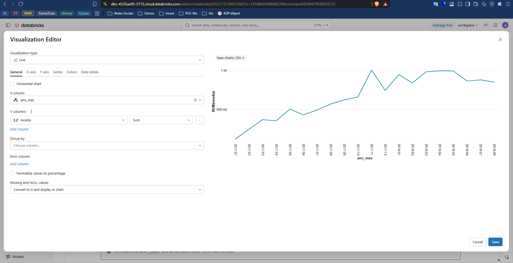

**Discussão.** A operação cresceu continuamente em 2017. **Novembro/2017** foi o primeiro mês acima de **R$ 1 milhão**, com +63% de pedidos sobre outubro.
O ranking diário explica: **24/11/2017, a Black Friday, teve 1.166 pedidos**, mais que o dobro do segundo melhor dia (25/11, com 499), e os dias 25 a 28/11 completam o top 5.
Em 2018 a operação se estabilizou em um patamar mais alto (6–7 mil pedidos/mês). No mesmo período (jan–ago), a receita foi de **R$ 3,08 mi (2017) para
R$ 7,34 mi (2018): +138%**. O ticket médio ficou estável (R$ 125–153), então **o crescimento veio do volume de pedidos**, e não do valor de cada compra.

## P2 · Categorias que concentram a receita

| # | Categoria | Receita (R$) | % | Itens | Preço médio (R$) |
|---|---|---:|---:|---:|---:|
| 1 | beleza_saude | 1.255.695 | 9,31 | 9.634 | 130,34 |
| 2 | relogios_presentes | 1.198.185 | 8,88 | 5.970 | **200,70** |
| 3 | cama_mesa_banho | 1.035.964 | 7,68 | **11.097** | 93,36 |
| 4 | esporte_lazer | 979.741 | 7,26 | 8.590 | 114,06 |
| 5 | informatica_acessorios | 904.322 | 6,70 | 7.781 | 116,22 |
| 6 | moveis_decoracao | 727.465 | 5,39 | 8.298 | 87,67 |
| 7 | utilidades_domesticas | 626.826 | 4,65 | 6.915 | 90,65 |
| 8 | cool_stuff | 620.770 | 4,60 | 3.779 | 164,27 |
| 9 | automotivo | 586.586 | 4,35 | 4.204 | 139,53 |
| 10 | ferramentas_jardim | 481.010 | 3,56 | 4.328 | 111,14 |

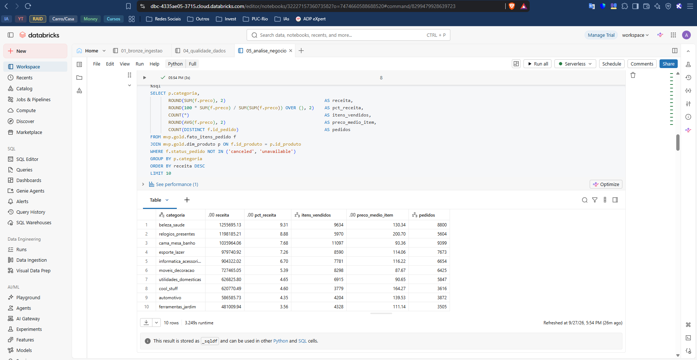

**Discussão.** Das 74 categorias, **as 10 maiores somam 62,4%** da receita total de R$ 13,49 milhões. Há dois perfis distintos:
- **volume:** cama_mesa_banho lidera em itens (11.097), com preço médio de R$ 93;
- **valor:** relogios_presentes quase empata em receita com cerca de metade dos itens, graças ao maior preço médio do top 10 (R$ 201).

Cada perfil pede uma estratégia: eficiência de frete para as categorias de volume, e conversão e parcelamento (ver P5) para as de alto valor.

## P3 · Diferenças regionais

| Região | % pedidos | Frete / valor | Dias de entrega (média) | Taxa de atraso | Nota média |
|---|---:|---:|---:|---:|---:|
| Sudeste | 68,6% | 15,2% | 10,7 | 6,1% | 4,14 |
| Sul | 14,3% | 17,6% | 14,0 | 5,9% | 4,16 |
| Nordeste | 9,5% | 21,7% | 19,9 | **12,7%** | **3,92** |
| Centro-Oeste | 5,8% | 17,6% | 15,0 | 6,5% | 4,09 |
| Norte | 1,9% | **22,7%** | **22,5** | 8,6% | 3,98 |

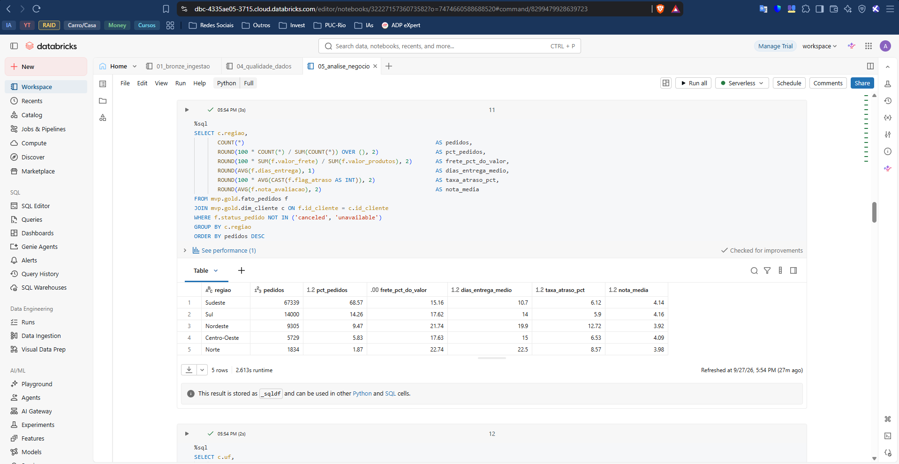

**Discussão.** A demanda é concentrada no Sudeste (68,6%, e **SP sozinho tem 41,9%**). A oferta é ainda mais concentrada: **71,3% dos itens são vendidos por
vendedores de SP**. Essa geografia explica os resultados: quanto mais longe de SP, maior o prazo e o peso do frete. Em SP a entrega leva 8,7 dias em média;
em RR, 29,3. No Norte e Nordeste o frete representa mais de 21% do valor dos produtos (13,8% em SP; 28,6% em RR).
O **Nordeste** é o ponto crítico: **maior taxa de atraso (12,7%) e menor nota (3,92)**, com AL (21,4% de atraso), MA (17,4%) e SE (15,2%) no extremo.
O Norte tem prazos maiores, mas atraso menor (8,6%), sinal de uma **promessa de prazo mais conservadora**.
O **RJ** foge ao padrão do Sudeste, com 12,1% de atraso e nota 3,90 (contra 4,5% e 4,21 em SP), o que indica um problema logístico específico do estado, e não apenas de distância.

## P4 · Atraso × nota de avaliação (hipótese central)

| Situação | Pedidos | Nota média | % notas 1–2 | % nota 5 |
|---|---:|---:|---:|---:|
| Entregue no prazo | 89.443 (93,3%) | **4,29** | 9,3% | 62,3% |
| Entregue com atraso | 6.381 (6,7%) | **2,27** | **62,4%** | 16,5% |

| Faixa (entrega vs. data prometida) | Pedidos | Nota média | % notas 1–2 |
|---|---:|---:|---:|
| adiantado > 10 dias | 61.523 | 4,32 | 8,9% |
| adiantado 1–10 dias | 26.640 | 4,23 | 10,0% |
| no dia prometido | 1.280 | 4,03 | 12,4% |
| atraso 1–3 dias | 1.852 | 3,29 | 32,1% |
| atraso 4–7 dias | 1.748 | 2,10 | 67,7% |
| atraso 8–14 dias | 1.446 | 1,67 | 80,2% |
| atraso > 14 dias | 1.335 | 1,72 | 78,4% |

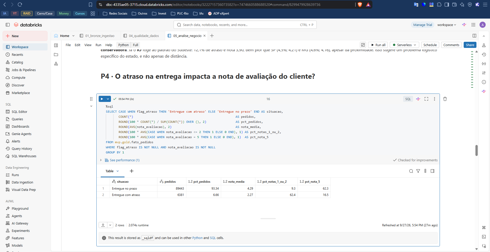

**Discussão.** **Sim, e o impacto é forte.** Pedidos atrasados têm nota média **2,27 contra 4,29** nos entregues no prazo, e as notas ruins (1–2) passam de 9% para **62%**.
O efeito é **dose-resposta**: 1–3 dias de atraso já derrubam a nota para 3,29, e acima de 8 dias ela se estabiliza perto de 1,7, com cerca de 80% de notas ruins.
A melhor nota ocorre quando o pedido chega **mais de 10 dias antes** do prometido. Isso só é possível porque a Olist promete em média **24,4 dias** e entrega em
**12,5** (mediana 10). A correlação linear dias de atraso × nota é −0,27: o efeito **não é linear**, e o que destrói a satisfação é **cruzar a data prometida**.
A série mensal liga P1 e P4: o atraso, em torno de 3–5% em 2017, saltou para **12,4% em nov/2017** (Black Friday) e para **14,1% e 19,0% em fev–mar/2018**.
Nos picos de demanda, a logística não acompanhou.
*Ressalva:* trata-se de uma associação observacional. Ainda assim, é grande, consistente em todas as faixas e plausível do ponto de vista de negócio.

## P5 · Meios de pagamento e parcelamento

| Meio principal | % pedidos | % valor | Ticket médio (R$) | Parcelas (média) |
|---|---:|---:|---:|---:|
| credit_card | 75,5% | 78,5% | 166,64 | 3,55 |
| boleto | 19,9% | 18,0% | 144,67 | 1,00 |
| voucher | 3,1% | 2,2% | 114,94 | 1,15 |
| debit_card | 1,5% | 1,4% | 140,27 | 1,00 |

| Cartão — faixa de valor | Pedidos | Parcelas (média) | % à vista |
|---|---:|---:|---:|
| até R$ 50 | 11.763 | 1,75 | 60,3% |
| R$ 50–100 | 22.272 | 2,72 | 42,8% |
| R$ 100–200 | 24.615 | 3,81 | 22,1% |
| R$ 200–500 | 12.820 | 5,17 | 12,9% |
| R$ 500–1.000 | 2.542 | 6,95 | 8,0% |
| acima de R$ 1.000 | 963 | 7,78 | 7,7% |

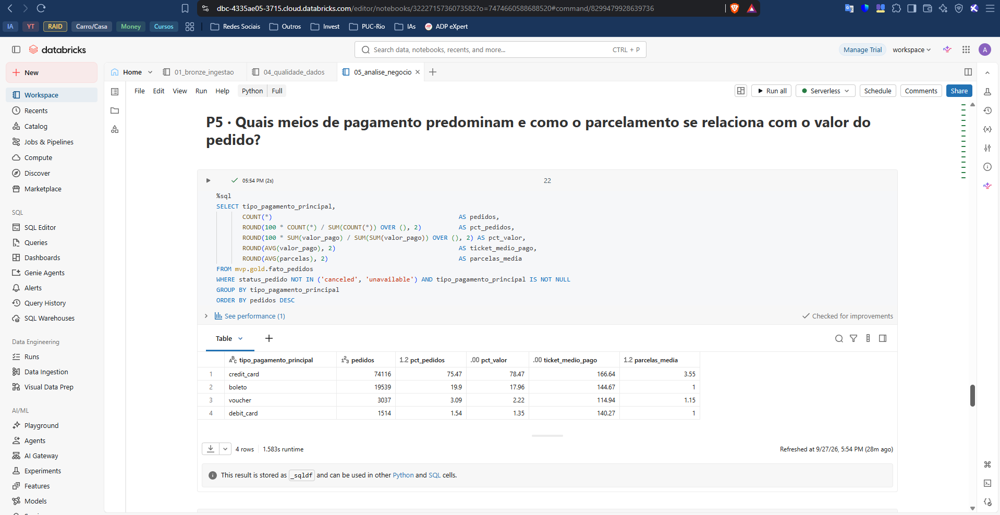

**Discussão.** O **cartão de crédito domina** (75,5% dos pedidos e 78,5% do valor); com o boleto, cobre mais de 95% das compras. O parcelamento **cresce com o valor**
(de 1,75 para 7,8 parcelas; correlação +0,37), mas **mesmo compras baixas são parceladas**: 57% dos pedidos de R$ 50–100 usam mais de uma parcela.
O parcelamento funciona como ferramenta de conversão e deve ser explorado nas categorias de alto valor identificadas em P2.

## P6 · Recompra e experiência na 1ª compra

| Indicador | Valor |
|---|---:|
| Clientes únicos | 96.096 |
| Clientes com mais de 1 pedido | 2.997 |
| **Taxa de recompra** | **3,12%** |
| Recompra, 1ª compra **no prazo** | 3,61% |
| Recompra, 1ª compra **atrasada** | 2,68% |
| Recompra, nota 5 na 1ª compra | 3,76% |
| Recompra, nota 1 na 1ª compra | 3,36% |

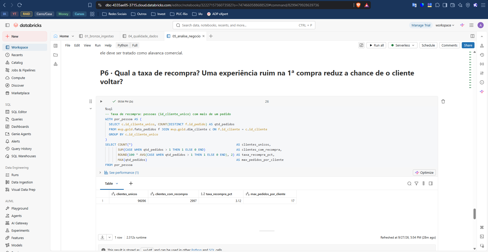
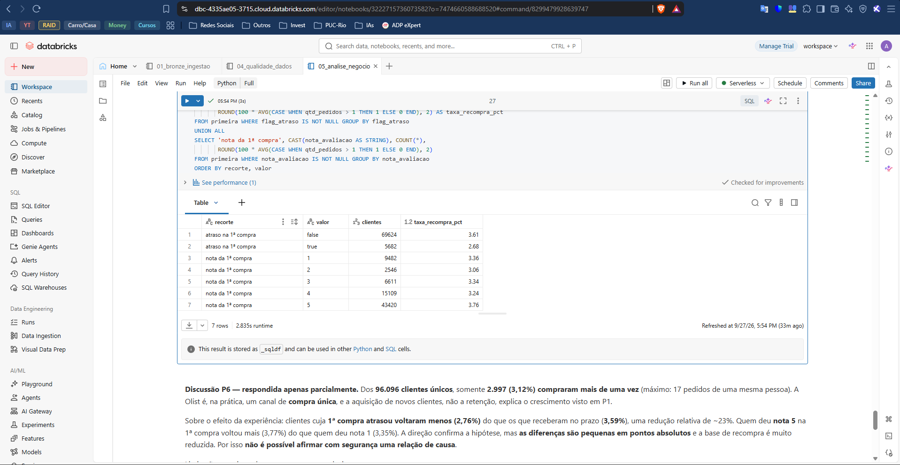

**Discussão: respondida apenas parcialmente.** Só **3,12%** dos clientes voltaram a comprar: a Olist é, na prática, um canal de compra única, e o crescimento de P1
vem da **aquisição**. Clientes cuja 1ª compra atrasou voltaram **menos** (2,68% contra 3,61%, cerca de −26% relativo), e quem deu nota 5 voltou mais do que quem deu nota 1.
A direção confirma a hipótese, mas as diferenças são pequenas em pontos absolutos e a base de recompra é reduzida. **Não é possível afirmar causalidade.**
Limitações: janela de ~2 anos, recompras fora da Olist não são observáveis e não há dados de campanhas de marketing.

## Discussão geral

1. **O crescimento veio de volume** (P1), com forte pico na Black Friday.
2. **Receita concentrada** em poucas categorias (P2) e em uma geografia (P3): o Sudeste compra, SP vende.
3. **A distância de SP define custo e prazo** (P3): Norte e Nordeste pagam proporcionalmente mais frete, esperam mais e sofrem mais atrasos.
4. **O atraso é o principal destruidor de satisfação** (P4): cruzar a data prometida derruba a nota de 4,29 para 2,27, e os picos de demanda elevaram o atraso.
5. **O cliente paga em cartão e parcela** (P5), inclusive em compras baixas.
6. **Quase ninguém volta** (P6), e há indícios, não conclusivos, de que uma má primeira experiência reduz ainda mais o retorno.

**Recomendação:** priorizar a **confiabilidade do prazo prometido**, sobretudo no Nordeste, no RJ e nos picos sazonais, preservando a margem de segurança
no prazo informado. Como a nota cai de forma abrupta ao cruzar a data prometida, **cumprir a promessa vale mais do que simplesmente entregar mais rápido.**

---

# 7. Autoavaliação

**Atingimento dos objetivos.** Cheguei a esta sprint sem experiência prática em Engenharia de Dados. Toda a minha experiência em TI está em gestão de projetos, embora tenha estudado programação na faculdade. Termos como Lakehouse, Delta Lake, Unity Catalog e arquitetura medalhão eram, para mim, apenas conceitos discutidos com equipes de trabalho (trabalho com gestão de projetos das equipes de sistemas e dados em minha empresa). Mesmo assim, o objetivo central foi atingido. Construí um pipeline completo na nuvem, no Databricks: 9 arquivos CSV brutos, passando pelas camadas Bronze, Silver e Gold e chegando a um modelo dimensional documentado. Cinco das seis perguntas (P1 a P5) foram respondidas de forma conclusiva, e a hipótese principal, de que o atraso na entrega derruba a satisfação do cliente, foi confirmada com evidência forte. A P6 (recompra) ficou respondida só em parte: medi a taxa de recompra (3,12%) e encontrei, com auxílio de IA, uma tendência coerente com a hipótese, mas a recompra é tão baixa que não permite afirmar causa. Mantive a pergunta, como orienta o enunciado.

**Como o trabalho foi feito e o papel da IA.** Estudar sozinho um tema novo, com prazo curto (trabalho com nova função e muitos cursos), foi a maior dificuldade. Por isso usei um assistente de IA (Claude) como tutor e parceiro de desenvolvimento durante todo o MVP. Ele me ajudou a interpretar o enunciado e as orientações das aulas, ajudou com o dataset da Olist, na escrita da primeira versão dos notebooks e da documentação e me guiou passo a passo no uso da plataforma. Preparar o ambiente, executar todo o pipeline no Databricks, conferir os resultados de cada etapa e se faziam sentido, gerar as evidências e revisar o relatório foi um trabalho muito satisfatório e que vai me ajudar muito no meu trabalho.

**O que aprendi (e o que mais me surpreendeu).**

Na prática, o dado nunca está pronto. A base parecia limpa, sem nulos nas chaves, mas as verificações de qualidade revelaram avaliações duplicadas por pedido, datas incoerentes e categorias sem tradução. Entendi o motivo de a camada Silver existir.
O grão da tabela muda o resultado. Assim, se a nota do pedido fosse repetida em cada item, as médias sairiam distorcidas. Com isso o modelo tem duas tabelas fato. Foi o conceito de modelagem que mais fez sentido para mim na prática.
**Detalhes de definição importam.** Comparar a data de entrega com a data prometida, e não os horários, muda o conceito de "atrasado".
**Plataforma:** foi meu primeiro contato com Unity Catalog, Volumes, tabelas Delta e o Catalog Explorer. Ver o catálogo de dados e o diagrama de relacionamentos sendo gerados a partir dos comentários no código deixou claro o valor da governança vista nas aulas.

**Dificuldades.** Além da falta de experiência, tive de aprender tarefas operacionais de desenvolvimento que pareciam simples, mas eram novas para mim: baixar e organizar a base do Kaggle, importar notebooks no Databricks, enviar arquivos para um Volume, tirar as evidências certas e como publicar tudo no GitHub.

**Trabalhos futuros.** Meu próximo passo é reescrever sozinho partes do pipeline, especialmente as transformações da Silver, para consolidar o aprendizado sem depender da IA. Tecnicamente, o projeto poderia evoluir com: orquestração dos notebooks em um Databricks Job; carga incremental; verificações de qualidade automatizadas; uso da geolocalização para medir o efeito da distância no prazo; análise de sentimento dos comentários das avaliações; e um dashboard com os indicadores de P1 a P5. A ideia é "brincar" e testar até que tudo seja feito com naturalidade.
